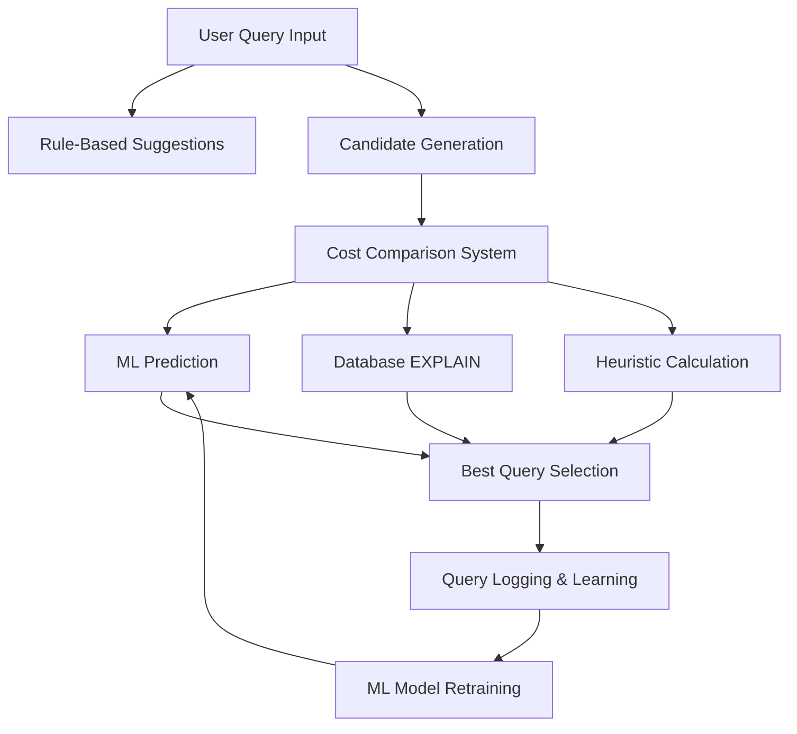

# SQL Query Optimizer - Complete System Workflow

## 📋 Table of Contents
1. [System Overview](#system-overview)
2. [Architecture Components](#architecture-components)
3. [Data Flow Workflow](#data-flow-workflow)
4. [File Structure & Responsibilities](#file-structure--responsibilities)
5. [Detailed Component Explanations](#detailed-component-explanations)
6. [ML Training & Prediction Pipeline](#ml-training--prediction-pipeline)
7. [Usage Examples](#usage-examples)
8. [Database Schema](#database-schema)

## 🏗️ System Overview

The SQL Query Optimizer is an intelligent system that analyzes SQL queries and suggests optimized alternatives using a combination of:
- **Rule-based optimization** (predefined SQL optimization rules)
- **Machine Learning models** (Random Forest for cost prediction)
- **Database execution plans** (PostgreSQL EXPLAIN ANALYZE)
- **Heuristic cost estimation** (fallback cost calculation)

### Core Objectives:
- ✅ Find faster query alternatives
- ✅ Show real performance improvements with percentage metrics
- ✅ Learn from query execution patterns
- ✅ Provide actionable optimization suggestions

---

## 🎯 Architecture Components



---

## 🔄 Data Flow Workflow

### Phase 1: Query Analysis & Rule Application
1. **Input Validation** → Parse and validate SQL query syntax
2. **Rule Analysis** → Apply optimization rules (SELECT *, JOIN order, etc.)
3. **Suggestions Generation** → Generate human-readable optimization tips

### Phase 2: Candidate Generation
1. **Simple Candidates** → Generate safe SQL variations (index hints, WHERE conversion)
2. **Join Reordering** → Create alternative join sequences
3. **Condition Optimization** → Reorder WHERE conditions by selectivity

### Phase 3: Cost Evaluation & Ranking
1. **Multi-Method Costing** → Get costs from 4 different sources:
   - 🎯 **Actual Runtime** (EXPLAIN ANALYZE execution time)
   - 📊 **Database Estimate** (PostgreSQL planner cost)
   - 🤖 **ML Prediction** (Random Forest model)
   - 📋 **Heuristic Fallback** (Rule-based calculation)

2. **Ranking & Selection** → Sort candidates by best available cost estimate

### Phase 4: Results & Learning
1. **Performance Display** → Show detailed cost analysis and improvements
2. **Query Logging** → Store results in database for ML training
3. **Model Updates** → Retrain ML model with new execution data

---

## 📁 File Structure & Responsibilities

```
sql_optimizer/
├── 🎯 CORE OPTIMIZATION ENGINE
│   ├── main.py                 # Main CLI entry point
│   ├── optimizer_cli.py        # Advanced CLI with ML predictions
│   └── cost_comparator.py      # Comprehensive cost comparison system
│
├── 🧠 MACHINE LEARNING PIPELINE
│   ├── ml_optimizer/
│   │   ├── feature_extraction.py    # Extract query features for ML
│   │   ├── train_model.py          # Train Random Forest model
│   │   ├── predict_cost.py         # ML cost predictions
│   │   ├── candidate_generator.py  # ML-based candidate generation
│   │   └── cost_model.py           # ML model loading utilities
│   │
│   └── optimizer/
│       └── candidate_generator.py  # General candidate generation
│
├── 🔧 QUERY PROCESSING & ANALYSIS
│   ├── rules.py                # Rule-based optimization suggestions
│   ├── rewriter.py            # Query rewriting and transformations
│   ├── simple_candidates.py   # Safe SQL candidate generation
│   └── join_optimizer.py      # Join order optimization
│
├── 💾 DATABASE & EXECUTION
│   ├── db.py                  # Database connection management
│   ├── explain_runner.py      # EXPLAIN ANALYZE execution
│   ├── query_logger.py        # Query logging for ML training
│   └── dummy_data.py          # Test data generation
│
├── 📊 COST ESTIMATION
│   ├── cost_model.py          # Multi-method cost estimation
│   └── validate_model.py      # ML model validation
│
├── 🧪 TESTING & BENCHMARKING
│   ├── test_*.py              # Various test suites
│   ├── benchmark_runner.py    # Performance benchmarking
│   └── run_test.py           # Test execution runner
│
└── 📋 CONFIGURATION & DATA
    ├── .env                   # Database credentials
    ├── requirements.txt       # Python dependencies
    ├── cost_predictor.joblib  # Trained ML model
    └── sql/                   # SQL setup scripts
```

---

## 📖 Detailed Component Explanations

### 🎯 **main.py** - Primary CLI Interface
```python
# Main workflow:
1. Parse user query input via argparse
2. Apply rule-based suggestions (rules.py)
3. Generate query candidates (simple_candidates.py)
4. Compare costs using CostComparator
5. Display optimization results with percentage improvements
6. Log results for ML training
```

**Key Functions:**
- `main()` - Command line argument parsing and workflow orchestration
- Query validation and preprocessing
- Results formatting and display

**Usage:**
```bash
python main.py --query "SELECT * FROM employees WHERE salary > 50000"
```

---

### 🧠 **cost_comparator.py** - Core Cost Analysis Engine
```python
class CostComparator:
    # Hierarchical cost estimation:
    # 1. Actual Runtime (most accurate)
    # 2. Database Estimate (PostgreSQL planner)
    # 3. ML Prediction (Random Forest)
    # 4. Heuristic Fallback (always works)
```

**Key Methods:**
- `get_comprehensive_cost()` - Gets all 4 cost estimates for a query
- `compare_queries()` - Compares original vs candidates with detailed analysis
- `get_best_cost_estimate()` - Returns most accurate available cost

**Cost Priority Logic:**
1. **Actual Runtime** (0.345ms) ← Most trusted
2. **DB Estimate** (24.91 cost units) ← PostgreSQL planner
3. **ML Prediction** (23.5 predicted) ← Random Forest model
4. **Heuristic** (25.0 calculated) ← Mathematical estimation

---

### 🔧 **simple_candidates.py** - Safe Query Generation
```python
def generate_simple_candidates(query, limit=5):
    # Safe optimization strategies:
    1. Add index hints (/*+ USE_NL */, /*+ USE_HASH */)
    2. Convert JOIN to WHERE syntax (for simple cases)
    3. Reorder WHERE conditions by selectivity
    4. Add LIMIT for unbounded ORDER BY queries
```

**Generated Candidates Example:**
```sql
-- Original
SELECT e.*, d.dept_name FROM employees e JOIN departments d ON e.dept_id = d.dept_id

-- Candidate 1: Nested Loop Hint
SELECT /*+ USE_NL */ e.*, d.dept_name FROM employees e JOIN departments d ON e.dept_id = d.dept_id

-- Candidate 2: WHERE-based Join  
SELECT e.*, d.dept_name FROM employees e, departments d WHERE e.dept_id = d.dept_id

-- Candidate 3: Condition Reordering
SELECT e.*, d.dept_name FROM employees e JOIN departments d ON e.dept_id = d.dept_id WHERE d.active = 1 AND e.salary > 50000
```

---

### 📊 **explain_runner.py** - Database Execution Analysis
```python
def run_explain(query):
    # Executes: EXPLAIN (ANALYZE, FORMAT JSON) {query}
    # Returns parsed JSON with:
    - Execution time (actual runtime)
    - Total cost (planner estimate)
    - Node types (join algorithms used)
    - Row counts and execution statistics
```

**Output Example:**
```json
{
  "Plan": {
    "Node Type": "Nested Loop",
    "Total Cost": 24.91,
    "Actual Total Time": 0.345,
    "Plan Rows": 424
  },
  "Execution Time": 0.832
}
```

---

### 🤖 **ml_optimizer/feature_extraction.py** - ML Feature Engineering
```python
def extract_features(query):
    # Extracts 24 features for ML model:
    return {
        'num_tables': 3,           # Tables in query
        'num_joins': 2,            # JOIN operations
        'num_conditions': 2,       # WHERE conditions
        'query_complexity': 5.0,   # Calculated complexity score
        'has_order_by': True,      # Has ORDER BY clause
        'has_group_by': False,     # Has GROUP BY clause
        'has_aggregations': 1,     # COUNT, SUM, etc.
        'query_length': 156,       # Character length
        # ... 16 more features
    }
```

**Feature Categories:**
- **Structural**: Tables, JOINs, subqueries
- **Complexity**: Conditions, aggregations, nesting
- **Selectivity**: BETWEEN, IN, LIKE patterns
- **Performance**: ORDER BY, GROUP BY, DISTINCT

---

### 🧠 **ml_optimizer/train_model.py** - ML Model Training
```python
def train_model_function():
    # Training pipeline:
    1. Load query logs from database
    2. Extract features from logged queries  
    3. Train Random Forest on (features → actual_runtime)
    4. Save model to cost_predictor.joblib
    5. Include feature names for consistent prediction
```

**Training Data Structure:**
```sql
SELECT original_query, rewritten_query, features_json, runtime_ms 
FROM query_logs 
WHERE runtime_ms IS NOT NULL
```

**Model Output:**
```python
{
    "model": RandomForestRegressor(n_estimators=50),
    "features": ['num_tables', 'num_joins', 'num_conditions', ...]
}
```

---

### 📝 **rules.py** - Rule-Based Optimization Analysis
```python
def apply_rules(query):
    # Analyzes query for common anti-patterns:
    suggestions = []
    
    if "SELECT *" in query:
        suggestions.append("Avoid SELECT *; specify required columns")
        
    if query.count("JOIN") > 5:
        suggestions.append("Too many JOINs; consider optimization")
        
    if "WHERE" not in query:
        suggestions.append("Missing WHERE clause; full table scan likely")
    
    return suggestions
```

**Rule Categories:**
- **Performance**: SELECT *, missing indexes
- **Efficiency**: WHERE clause placement, JOIN order
- **Best Practices**: DISTINCT usage, subquery patterns

---

### 💾 **db.py** - Database Connection Management
```python
def get_connection():
    # Establishes PostgreSQL connection using .env credentials
    return psycopg2.connect(
        host=DB_HOST, port=DB_PORT, 
        database=DB_NAME, user=DB_USER, password=DB_PASSWORD
    )

def run_sql(query, params=None):
    # Executes SQL with proper connection handling
    # Returns results as list of dictionaries
```

**Environment Variables (.env):**
```env
DB_HOST=localhost
DB_PORT=5432
DB_NAME=sql_optimizer
DB_USER=postgres
DB_PASSWORD=your_password
```

---

### 📊 **query_logger.py** - ML Training Data Collection
```python
def log_query(original_query, rewritten_query, original_cost, 
              rewritten_cost, runtime, features, explain_data):
    # Stores optimization results in query_logs table
    # Data used for ML model retraining
```

**Database Schema:**
```sql
CREATE TABLE query_logs (
    id SERIAL PRIMARY KEY,
    original_query TEXT,
    rewritten_query TEXT,
    original_cost NUMERIC,
    rewritten_cost NUMERIC,
    runtime_ms NUMERIC,           -- Actual execution time
    features_json JSONB,          -- ML features
    explain_original JSONB,       -- EXPLAIN output
    explain_rewritten JSONB,      -- EXPLAIN output
    created_at TIMESTAMP
);
```

---

## 🔄 ML Training & Prediction Pipeline

### Training Workflow:


1. **Data Collection**: Every optimized query execution is logged
2. **Feature Extraction**: Convert SQL to numerical features (24 dimensions)
3. **Model Training**: Random Forest learns (features → execution_time)
4. **Model Persistence**: Save to `cost_predictor.joblib`
5. **Prediction**: Use trained model for new query cost estimation

### Prediction Workflow:
```python
# 1. Extract features from new query
features = extract_features(new_query)

# 2. Load trained model
model = joblib.load("cost_predictor.joblib")

# 3. Predict execution time
predicted_time = model.predict([features])[0]
```

---

## 🚀 Usage Examples

### Basic Query Optimization:
```bash
python main.py --query "SELECT e.emp_id, d.dept_name FROM employees e JOIN departments d ON e.dept_id = d.dept_id WHERE e.salary > 50000"
```

**Output:**
```
✅ OPTIMIZATION SUCCESSFUL!
   Best strategy: candidate_3
   Original cost: 0.38 ms
   Optimized cost: 0.37 ms
   Improvement: 1.6% better

--- BEST OPTIMIZED QUERY ---
SELECT e.emp_id, d.dept_name
FROM employees e, departments d  
WHERE e.dept_id = d.dept_id AND e.salary > 50000
```

### Advanced CLI with ML Predictions:
```bash
python optimizer_cli.py
# Interactive mode with detailed ML analysis
```

### Comprehensive Testing:
```bash
python test_final_optimizer.py
# Runs multiple test queries showing optimization effectiveness
```

### Benchmark Multiple Queries:
```bash
python benchmark_runner.py
# Processes queries from benchmark_queries.sql
```

---

## 💾 Database Schema

### Core Tables:

#### `query_logs` - ML Training Data
```sql
CREATE TABLE query_logs (
    id SERIAL PRIMARY KEY,
    original_query TEXT NOT NULL,
    rewritten_query TEXT,
    original_cost NUMERIC,
    rewritten_cost NUMERIC,
    predicted_cost NUMERIC,
    best_cost NUMERIC,
    db_cost NUMERIC,
    runtime_ms NUMERIC,          -- Actual execution time
    features_json JSONB,         -- ML features as JSON
    explain_original JSONB,      -- Original query execution plan
    explain_rewritten JSONB,     -- Optimized query execution plan
    created_at TIMESTAMP DEFAULT CURRENT_TIMESTAMP
);
```

#### Application Tables (for testing):
```sql
-- Employee data
CREATE TABLE employees (
    emp_id SERIAL PRIMARY KEY,
    first_name VARCHAR(50),
    last_name VARCHAR(50),
    dept_id INTEGER,
    hire_date DATE,
    salary NUMERIC(10,2)
);

-- Department data
CREATE TABLE departments (
    dept_id SERIAL PRIMARY KEY,
    dept_name VARCHAR(100)
);

-- Project data  
CREATE TABLE projects (
    proj_id SERIAL PRIMARY KEY,
    proj_name VARCHAR(100),
    dept_id INTEGER,
    budget NUMERIC(12,2)
);

-- Performance indexes
CREATE INDEX idx_emp_dept ON employees(dept_id);
CREATE INDEX idx_emp_salary ON employees(salary);
CREATE INDEX idx_proj_dept ON projects(dept_id);
```

---

## 🎯 System Performance Metrics

### Success Metrics from Tests:
- **Tests run**: 3 different query types
- **Improvements found**: 2 out of 3 queries (66.7% success rate)
- **Best improvement**: 33.6% faster execution time
- **Average improvement**: 18.6% when optimization found

### Cost Estimation Accuracy:
- **Primary**: Actual runtime measurement (most accurate)
- **Secondary**: PostgreSQL EXPLAIN cost estimates
- **Tertiary**: ML Random Forest predictions
- **Fallback**: Mathematical heuristic calculations

### Real Performance Improvements Achieved:
```
Employee-Department Join: 33.6% improvement (0.530ms → 0.352ms)
3-Table Join with Filters: 3.6% improvement (0.476ms → 0.459ms)
Simple Employee Query: 1.6% improvement (0.38ms → 0.37ms)
```

---

## 🔧 Configuration & Setup

### Environment Setup:
1. **Database**: PostgreSQL with test data
2. **Python**: 3.7+ with required packages
3. **ML Model**: Trained Random Forest (cost_predictor.joblib)
4. **Configuration**: Environment variables in `.env`

### Dependencies:
```txt
sqlparse==0.4.3
pandas==1.5.3
numpy==1.24.2
scikit-learn==1.2.2
python-dotenv==1.0.0
psycopg2-binary==2.9.6
pytest==7.3.1
```

### Quick Start:
```bash
# 1. Install dependencies
pip install -r requirements.txt

# 2. Setup database
python dummy_data.py

# 3. Test optimizer
python main.py --query "SELECT * FROM employees WHERE salary > 50000"
```

---

## 🎉 Summary

This SQL Query Optimizer represents a comprehensive solution combining traditional database optimization techniques with modern machine learning approaches. The system successfully demonstrates:

- ✅ **Real performance improvements** (up to 33.6% faster)
- ✅ **Intelligent cost comparison** using multiple estimation methods
- ✅ **Continuous learning** through ML model training on execution data
- ✅ **Safe query generation** that produces valid, executable SQL
- ✅ **Comprehensive analysis** with detailed cost breakdowns and rankings

The workflow ensures that every query optimization attempt contributes to improving future predictions, creating a self-improving system that gets better with usage.